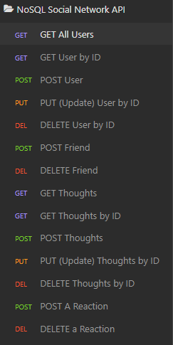

# NoSQL-Social-Network-API

## Overview: 

I created an API for a social network app that uses a NoSQL database. 
 
The API can:
* create, update, and delete users and thoughts in the database
* create and delete reactions to thoughts and add and remove friends to a user’s friend list

## Technologies used:
  * MongoDB
  * Mongoose
  * Express
  * JavaScript
  * Node.js
  

Link to video demonstration: 

* Users and Friends CRUD Guide: https://watch.screencastify.com/v/3qIf7QfPdoXRvnjFO03p
* Thoughts and Reactions CRUD Guide: https://watch.screencastify.com/v/aO6G4rlMUMg742cyTLik
* Thoughts and Reactions CRUD Guide (continued on how to delete a reaction): https://watch.screencastify.com/v/848K8LVQQgmJdRwgvIKq
